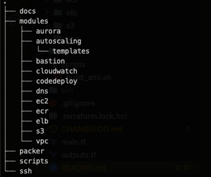

# Keyedin AWS Infrastructure

Infrastructure code for setting up Keyedin.app. [Keyedin App](https://keyedin.app/) is currently configured to run on Amazon AWS environment.

This repository contains code based on the [Terraform](https://www.terraform.io/) software. Terraform is an infrastructure as code framework that can be used to describe cloud infrastructure for numerous cloud providers. The following sections below will describe the different bits needed for running the code in this repository.

## System Requirements

- An AWS Account with Administrative permission.
- An AWS IAM user credential (ACCESS KEY ID and ACCESS SECRET)
- [Terraform](https://www.terraform.io/) software installed on your machine.

## Table of Content

- [System Requirements](#system-requirements)
- [Keyedin App Architecture](#keyedin-app-architecture)
- [Project Directory Structure](#project-directory-structure)
- [Packer](#packer)
  - [Terraform State Backend](#terraform-state-backend)
- [AWS Resources](#aws-resources)
  - [Amazon Elastic Container Registry (ECR)](#amazon-elastic-container-registry-ecr)
  - [CodeDeploy](#codedeploy)
  - [S3 Bucket](#s3-bucket)
  - [Autoscaling](#autoscaling)
  - [Aurora Database](#aurora-database)
  - [Bastion Host](#bastion-host)
  - [Elastic Load Balancer](#elastic-load-balancer)
  - [DNS - Route53](#dns---route53)
  - [AWS VPC](#aws-vpc)
- [Future Improvements](#future-improvements)

## Project Directory Structure

The repository tries to adopt a module based layout for groups of Terraform AWS resoruces. This is so as to isolate and group related resources together.

The AWS infrastcture setup live under the `modules` folder. Each folder is names according to their puporse. The stray `ssh` folder is used to store the generated SSH Keys generated during the terraform build process. The `packer` folder holds a simple template file that describes the Amazon EC2 AMI that will be used to launch all EC2 instances.

The AMI generated by Packer also installs the CodeDeploy agent that is need by CodeDeploy to deploy the [Keyedin PHP Project](https://github.com/KeyedIn-App/keyedin-backend).

## Packer

Packer is an image creating tool that supports multiple cloud vendors and is currently used in this case to create AWS AMI used by the EC2 instances that run the Keyedin laravel project. The exception is the Bastion host currently the traditional Amazon Linux AMI. To learn more about Packer, view the site [Packer.io](https://packer.io)

### Terraform State Backend

Terraform has a feature called backend which is a mechanism for storing the state of the cloud infrastructure you created. By default Terraform stores states locally but in order to allow distributed management of states by different developers, Terraform provides remote states.

The Keyedin Project stores its state in the S3 bucket `keyedin-private/infrastructure`. Everytime you make a change to terraform, it updates and synchronizes the states.

## AWS Resources

For most of the commands you will run within Terraform, it is assumed you have an AWS credentials named `keyedin`. If this isn't setup, then the command won't work.

### Amazon Elastic Container Registry (ECR)

The keyedin App Laravel project makes use fo Docker. For the staging environment which lives on DigitalOcean, the Docker image is pushed to Docker Hub. Since the production environment is slated to run on AWS, it only made sense to make use of ECR which is a container registry like Docker Hub. The Laravel Project builds the Docker image and pushes it to AWS ECR. This is now pulled on the EC2 instance during deployment.

The path to the ECR registry is `keyedin/backend` for the PHP image and `Keyedin/nginx` for the Nginx image. Once the image has been created, the CodeDeploy config pulls the latest image and deploys them to the EC2 instances.

### CodeDeploy

On the PHP side of things, we create a deployment which is a zip file that makes use of a few bootstrap scripts and adopts the CodeDeploy agent `appspec.yml`. The `appspec.yml` file, calls a bunch of scripts that handle traffic control on the Load Balancer. It also sends SNS notification if a Deployment fails.

### S3 Bucket

This project creates a `keyedin-public` S3 bucket that can be used to host public assets. There is also an S3 bucket named `keyedin-private` which contains the path `infrastructure` and `releases`. The `release` path is to store release assets that contains the latest project build (Docker image) and version info that will be deployed to the servers. The `keyedin-private` bucket isn't managed by Terraform. This was so as not to accidentally delete the bucket during a `terraform destroy`.

### Autoscaling

We make use of autoscaling to handle traffic behind the load balancer. In order to keep cost down, the current autoscaling has been setup to run a Single On-Demand EC2 instance. At the moment, we set the Autoscaling group to scale up servers when the traffic to a box hits 1000. This value is assumed and should be changed as realtime traffic is observed.

The autoscaling group during scale out makes use of mixed instance types. It uses spot instances to scale out.

### Aurora Database

For the databse, we are making use of AWS Aurora database which is a Mysql 5.7 compatible database. It currently sits in the private subnet and can only be access via the Bastian host. Due to cost, it was decided to not use Multiple Availability Zone setup of Aurora but instance we running a single database. This should be reviewed to use Multiple AZ as the project continues.

### Bastion Host

We traditionally should have all our EC2 instances running in the private subnet but at first launch we went with placing them in the public subnet to reduce cost and not have to run NAT Gateways. However, the role of the Bastion host at the momemt is to be a gateway to access the Aurora database when needed. It is currently running a `t2.micro` instance which should make use of the AWS Free-tier.

### Elastic Load Balancer

Elastic Load Balancer has been configured for the EC2 instances. The Application Load balancer can be controlled by the deployment script when EC2 instances are spun up so as not to report an unhealthy instance during deployment. All `http` traffic to the laod balancer automatically redirects to `https`.

### DNS - Route53

The Keyedin domain setup lives in the `dns` module and is used to generate the Nameservers that is then registered on the Domain Registrar. it also maps the domain to the Application Load Balancer.

### AWS VPC

This is a custom VPC dedicated to Keyedin Resources. It is composed of three public subnets and three private subnets. It currently doesn't have an Elastic IP address in order to reduce cost.

## Future Improvements

- We should adopt recommended best practices recommended by AWS.
- We should place all EC2 instances in the private subnet and have NAT gatways deployed there for access.
- Upgrade the MYSQL database to run on a Multiple Availability Zone so as to handle data redundancy and have both read and write replica's to improve database performance.
- Upgrade PHP Project to make use of Elastic Container Service which will enable Blue-Green deployment and we don't have to manually provision EC2 instances.
- Add more logging to Cloudwatch for overall systems monitoring and improvement.
